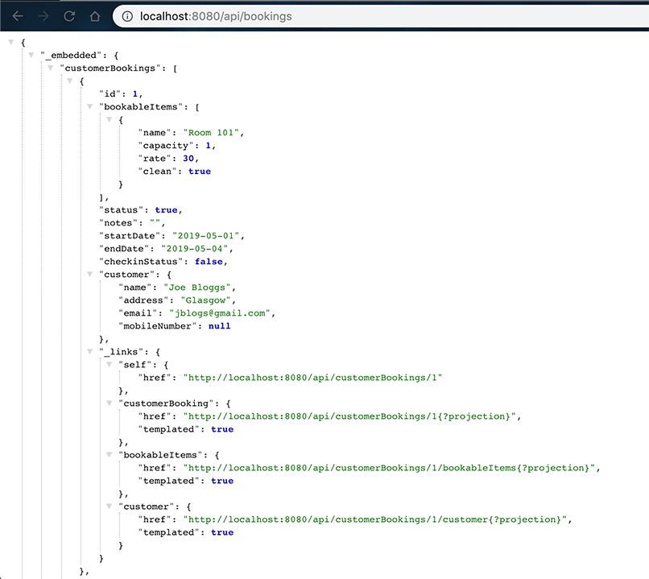
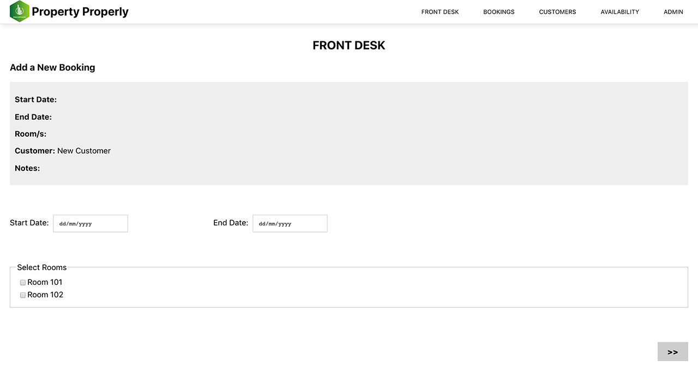

# Property Properly

April 2019.

Contributors: [John Page](https://github.com/JDEHPage), [Stuart Bell](https://github.com/XrNrX) and [Carme Mias](https://github.com/carmemias).

## Description

In-house system for vacation property management, facilitating reservation and administrative tasks for the property owners and/or their staff.

The back end system consists of an API built with Java, Spring, Hibernate and PostGreSQL. The front end has been built with React.

_A screenshot of the bookings API._

_The first version of the Front Desk dashboard_

Please note that no user authentication has been implemented at this stage.

For more information, please refer to the [Detailed Project Description](https://docs.google.com/document/d/19YSkiM2PH1dJ9gN5dtCk6xmPetbS9ELGohs17HP5Ars/edit?usp=sharing).
